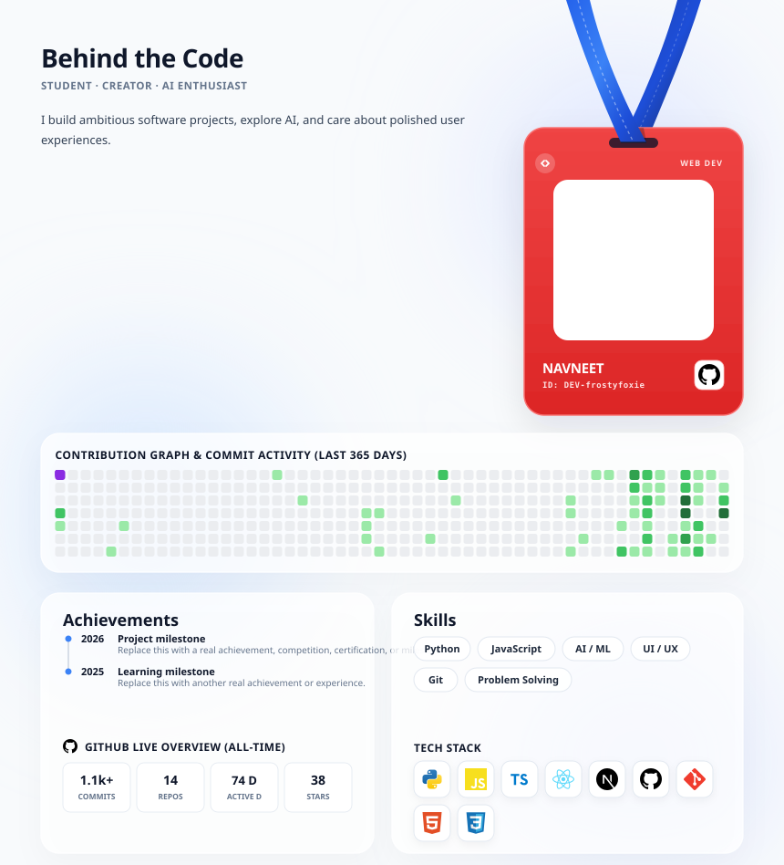
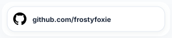
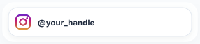
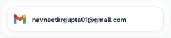

# SVG Profile Generator



Create a polished, animated GitHub profile SVG that fills itself with **real GitHub statistics** and can be customized with your own profile information.

The first run is designed to be beginner-friendly: **the action creates `.github/profile.json` for you with mock-but-realistic data.** You do not have to manually create the configuration file before running the workflow.

## 🚀 Setup — follow these steps in order

### Step 0 — Enable GitHub Actions write access

Before creating the workflow, open your **profile repository → Settings → Actions → General**.

Under **Workflow permissions**, select:

**Read and write permissions**

Then click **Save**.

The workflow also explicitly requests:

```yaml
permissions:
  contents: write
```

GitHub documents that `contents: write` includes read access for that permission. If your organization or repository policy prevents write access, the workflow will not be able to commit the generated files.

### Step 1 — Create the workflow

Go to:

**Actions → New workflow → set up a workflow yourself**

Create a workflow such as `.github/workflows/svg-profile.yml` and paste:

```yaml
name: Update GitHub Profile SVG

on:
  schedule:
    - cron: '17 */6 * * *'
  workflow_dispatch:
  push:
    paths:
      - '.github/profile.json'

permissions:
  contents: write

jobs:
  generate:
    runs-on: ubuntu-latest
    steps:
      - name: Check out repository
        uses: actions/checkout@v4
      - name: Generate profile
        uses: frostyfoxie/svg-profile-generator@v1
```

Commit the workflow file.

### Step 2 — Run the workflow once

Open:

**Actions → Update GitHub Profile SVG → Run workflow**

The first run will:

1. Fetch your real GitHub profile, contribution, repository and star data.
2. Create **`.github/profile.json` automatically** if it does not already exist.
3. Put mock-but-realistic editable profile content in that file.
4. Fetch missing technology/social icons from the internet.
5. Generate `profile.svg`, `btn_github.svg`, `btn_instagram.svg`, and `btn_email.svg`.
6. Commit those files and the new config back to your repository.

You should **not** manually create the config file before this first run.

> The generated `.github/profile.json` is the public configuration file. The temporary `config.json` used internally by the renderer is created automatically during the workflow and is not something you need to edit.

### Step 3 — Embed the generated SVG in your README

After the first workflow succeeds, add:

```markdown

```

You can also use the generated buttons:

```markdown
[](https://github.com/YOUR_USERNAME)
[](https://instagram.com/YOUR_HANDLE)
[](mailto:YOUR_EMAIL)
```

### Step 4 — Replace the mock data with your real data

Open **`.github/profile.json`** and replace the mock values with your own:

```json
{
  "contact": {
    "instagram": "your_real_handle",
    "email": "you@example.com"
  },
  "behind_the_code": {
    "subheading": "STUDENT · CREATOR · AI ENTHUSIAST",
    "description": [
      "Write your own short profile description here."
    ]
  },
  "achievements": [
    {
      "year": "2026",
      "title": "Your achievement",
      "description": "Short supporting detail"
    }
  ],
  "skills": ["Python", "JavaScript", "AI / ML", "UI / UX"],
  "tech_stack": ["python", "javascript", "typescript", "react", "nextdotjs", "github"]
}
```

Commit the config. Because the workflow watches `.github/profile.json`, it will regenerate the SVG automatically. You can also run it manually.

## 🖼️ Icons — internet by default, custom icons supported

The generator now has **two icon sources, in this order**:

1. **Your repository's `icons/` folder** — always preferred.
2. **Simple Icons CDN** — used automatically when a matching local icon is missing.

Downloaded icons are embedded into the generated SVG as base64 data, so the final `profile.svg` does not depend on the browser being able to load the CDN later.

For the email button, the action includes a built-in fallback icon. You can override it with your own `icons/email.svg`.

### Custom icons

Create an `icons/` folder at the repository root and upload files such as:

```
icons/
├── python.svg
├── react.svg
├── nextdotjs.svg
├── github.svg
├── instagram.svg
└── email.svg
```

Match the filename to the `tech_stack` value, case-insensitively:

```json
"tech_stack": ["python", "react", "my-custom-tool"]
```

then add:

```
icons/my-custom-tool.svg
```

Custom icons always win over internet-fetched icons.

If the runner has no outbound internet access, **upload the required icons locally**. The workflow log explicitly reports whether each icon was loaded locally, fetched, or unavailable.

## 📁 Expected repository structure

```
.github/
├── profile.json
└── workflows/
    └── svg-profile.yml

icons/                 ← optional custom icons

profile.svg
btn_github.svg
btn_instagram.svg
btn_email.svg
README.md
```

## ⚙️ Configuration fields

| Field | Required | Purpose |
| --- | --- | --- |
| `contact` | No | Instagram handle and email |
| `behind_the_code` | No | Subtitle and short profile description |
| `achievements` | No | Timeline displayed under **Achievements** |
| `skills` | No | Skill pills |
| `tech_stack` | No | Technology/social icons |

All fields have defaults, but **replace the generated mock profile content with your real information**.

## 🔄 Updating

The example workflow runs every 6 hours, can be run manually, and also runs when `.github/profile.json` changes.

Real GitHub statistics are fetched during every generation, so commits, repositories, stars and contribution activity are refreshed automatically.

## 🛠️ Troubleshooting

### The workflow cannot push

Check:

**Settings → Actions → General → Workflow permissions → Read and write permissions**

and make sure the workflow contains:

```yaml
permissions:
  contents: write
```

Then rerun it.

### `.github/profile.json` was not created

Make sure `actions/checkout@v4` runs before `frostyfoxie/svg-profile-generator@v1`, and make sure `commit: true` is being used.

### Icons are blank

Check the workflow log. Upload a matching icon to `icons/` if the CDN is unavailable or the icon name is not recognized.

### The README image is broken

Run the workflow successfully first. `profile.svg` must exist before embedding it.

## 📦 Marketplace

This repository is structured as a GitHub Action with the required root `action.yml`.

For a Marketplace release:

1. Keep the repository public.
2. Create a semantic-version release such as `v1.0.0`.
3. Select **Publish this Action to the GitHub Marketplace**.
4. Choose a category and publish.
5. Keep the `v1` major tag pointing to the latest compatible release.

## License / attribution

The generator uses the profile template and generator from [frostyfoxie/frostyfoxie](https://github.com/frostyfoxie/frostyfoxie). Please retain the applicable attribution and license terms when distributing or modifying the generator.
